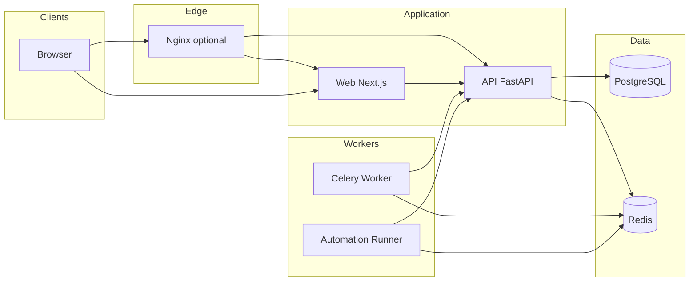

# Cloud Nexus

A central control plane and operations portal for the cloud/datacentre team. Internal enterprise platform with strong security, Active Directory integration, encrypted secrets, unified infrastructure visibility, reporting, controlled automation, and a Proxmox-focused RVTools-style explorer.

## Architecture



## Tech Stack

| Layer   | Stack |
|--------|--------|
| Frontend | Next.js 15, TypeScript, App Router, Tailwind CSS, shadcn/ui, TanStack Query, TanStack Table, Zod |
| Backend  | FastAPI, Python 3.12+, SQLAlchemy 2.x, Pydantic v2, Alembic, PostgreSQL, Redis |
| Jobs     | Celery with Redis |
| Auth     | SSO-first (OIDC/SAML), LDAP fallback, local break-glass admin, AD group → role mapping |
| Security | AES-256-GCM for connector secrets, Argon2id for passwords, RBAC, audit logging |

## Prerequisites

- Docker and Docker Compose (v2)
- Make (optional, for convenience targets)

## Quick Start

```bash
cp .env.example .env
# Edit .env: set POSTGRES_PASSWORD, SECRET_KEY, ENCRYPTION_KEY, ADMIN_PASSWORD
make up
make migrate
# Optional: set DEMO_MODE=true or SEED_DB=1 in .env then:
make seed
```

- **Web UI:** http://localhost:3000  
- **API:** http://localhost:8000  
- **API docs:** http://localhost:8000/docs  

## Environment

See [.env.example](.env.example). Never commit `.env` or secrets. Connector secrets are encrypted at rest with AES-256-GCM.

## Project Structure

See [STRUCTURE.md](STRUCTURE.md) for the full tree.

- **apps/web** — Next.js frontend  
- **apps/api** — FastAPI backend  
- **services/worker** — Celery worker  
- **services/automation-runner** — Automation runner (stub in Phase 1)  
- **services/connector-*** — Integration connectors (NetBox, Proxmox, vSphere, etc.)  
- **packages/** — shared-types, shared-ui, shared-utils  
- **infra/** — Docker and nginx config  
- **docs/** — Architecture, deployment, development  

## Development

| Command | Description |
|---------|-------------|
| `make up` | Start all services |
| `make down` | Stop all services |
| `make build` | Rebuild images |
| `make logs` | Follow logs |
| `make migrate` | Run DB migrations |
| `make seed` | Seed demo data (when DEMO_MODE or SEED_DB=1) |
| `make shell-api` | Shell in API container |
| `make shell-web` | Shell in Web container |
| `make test` | Run tests (stub) |
| `make lint` | Lint API (stub) |

## Deployment

- Clone or `git pull` on the server, then run `bash deploy.sh` (see [Deployment](docs/deployment.md) for Git URLs, Debian steps, and troubleshooting).
- Use Docker Compose with env-based config.
- Put a reverse proxy (e.g. nginx) in front of web and api; see `infra/nginx/`.
- Do not commit secrets; inject via env or secret manager.

## Security

- No secrets in the repository.
- Connector credentials encrypted at rest (AES-256-GCM).
- Local admin password hashed with Argon2id.
- RBAC on protected endpoints; sensitive actions audited.

## Roadmap

- **Phase 1:** Scaffold, Docker, backend/frontend base, auth/encryption/RBAC, seed (current).
- **Phase 2:** Connector framework, NetBox/Proxmox/vSphere/VyOS/AD stubs, sync jobs, drift/audit.
- **Phase 3:** Core UI (search, links, reports, runbooks, saved queries, health checks).
- **Phase 4:** Script library, automation-runner, Proxmox Explorer, Cloud Ops, exports, tests, docs.

## Documentation

- [Architecture](docs/architecture.md)
- [Deployment](docs/deployment.md)
- [Development](docs/development.md)
- [Production hardening & TODOs](docs/PRODUCTION-HARDENING.md)
